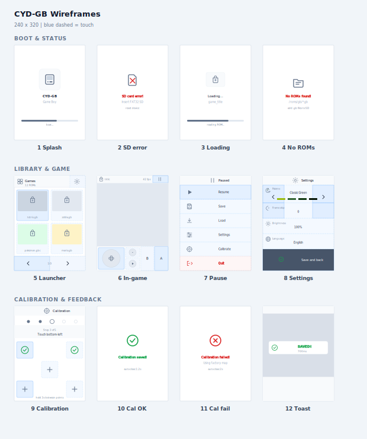

# CYD

[**ESP32-2432S028R**](https://github.com/witnessmenow/ESP32-Cheap-Yellow-Display) — Cheap Yellow Display: ESP32 + 2.8″ ILI9341 TFT + XPT2046 touch + microSD.

| App | What | Flash |
|-----|------|-------|
| [gb](gb/) | Game Boy / GBC emulator (FAT32 SD required) | `yarn gb:flash` |
| [arcade](arcade/) | 12 touch games (no SD) | `yarn arcade:flash` |

Hardware reference: [witnessmenow/ESP32-Cheap-Yellow-Display](https://github.com/witnessmenow/ESP32-Cheap-Yellow-Display)
