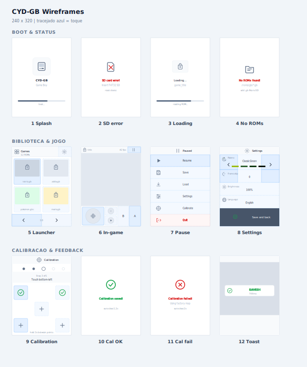

# ESP32-2432S028R (CYD)

[**Cheap Yellow Display**](https://github.com/witnessmenow/ESP32-Cheap-Yellow-Display) board (ESP32-2432S028R) — ESP32 with **2.8″ ILI9341** TFT, **XPT2046** touch, microSD slot, and RGB LED.

Board docs and pin map: [witnessmenow/ESP32-Cheap-Yellow-Display](https://github.com/witnessmenow/ESP32-Cheap-Yellow-Display).



## Projects

| Project | Description | Docs |
|---------|-------------|------|
| [**cyd-gb/**](cyd-gb/) | Game Boy / GBC emulator with SD ROM launcher, 52 palettes, BMP covers, and touch controls | [README](cyd-gb/README.md) |

### cyd-gb highlights

- 2×2 grid launcher with optional BMP covers on SD
- Virtual analog stick + A/B/Start/Select buttons
- 52 palettes (mono + multicolor), UI theme derived from palette
- i18n PT / EN / ES, 5-point touch calibration
- Config and saves in `/config/cyd-gb.cfg` and `/saves/` on SD
- Audio via DAC (GPIO 26), SPIFFS ROM cache

## Requirements

- [PlatformIO](https://platformio.org/) (CLI or IDE extension)
- [Yarn](https://yarnpkg.com/) 1.x
- **FAT32** microSD card (for cyd-gb)
- Python 3 + `cairosvg` + `Pillow` (only for `yarn cyd-gb:icons`)

## Quick start

From the monorepo root:

```bash
yarn cyd-gb:build
yarn cyd-gb:flash
yarn cyd-gb:monitor
```

Or inside the project:

```bash
cd cyd-gb
yarn fw:flash
yarn fw:monitor
```

## Credits

- **CYD hardware** — [witnessmenow/ESP32-Cheap-Yellow-Display](https://github.com/witnessmenow/ESP32-Cheap-Yellow-Display) (MIT).
- **cyd-gb emulator base** — forked from [artanergin44-collab/cyd-gb](https://github.com/artanergin44-collab/cyd-gb) (MIT).
